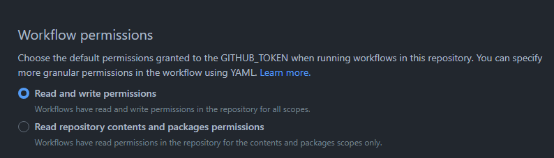

##########################
 RST AutoFormatter Action
##########################

A GitHub Action that automatically formats reStructuredText (rst) files
in your project using ``rstfmt`` every time you make a push or a pull
request. This is done with a bit of complicated shell madness, and
Python.

*******
 Usage
*******

**Check if "Read and write permissions" are enabled in Settings ->
Actions -> General -> Workflow permissions:**

To use this action, you need to create a workflow (``.yml`` or ``.yaml``
file) in the ``.github/workflows`` directory of your repository. and
add the following code to it:

.. code:: yaml

  name: RST Autoformatter

  on: [push, pull_request]

  jobs:
    test:
      runs-on: ubuntu-latest
      steps:
        - name: Check out code
          uses: actions/checkout@v3

        - name: Set up Python
          uses: actions/setup-python@v4
          with:
            python-version: '3.10'

        - name: Run RST Autoformatter
          uses: livxy/rst-autoformatter-action@main
          with:
            # files: '**/*.rst' # works! - globbing is supported
            # files: 'tests/*.rst' # works! - just another glob patterns
            # files: 'tests/lines.rst' # works! - single file
            # files: '{tests/admonitions,tests/escaped-text}.rst' # works! - brace expansion is supported (Unix trick)
            # For more patterns, see https://mywiki.wooledge.org/glob#Globs
            files: '**/*.rst'
            commit: 'true'
            github-username: 'github-actions'
            commit-message: 'Automated RST formatting'

*********
 License
*********

``rst-autoformatter-action`` is licensed under ``MIT``. See the `LICENSE
</LICENSE>`_ file for more information.
